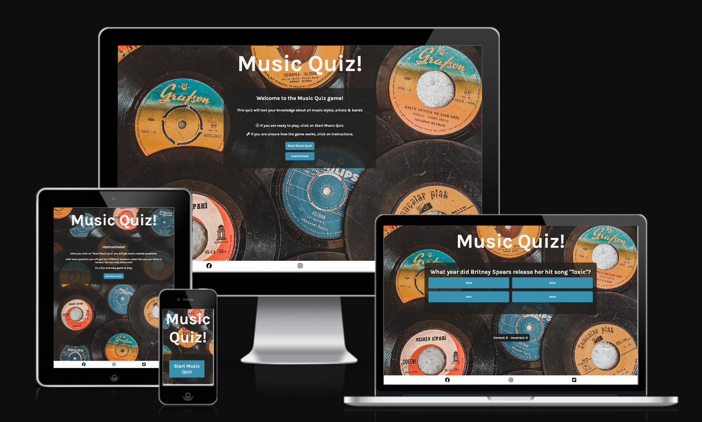

# Music Quiz
Music Quiz is an online quiz for anyone who would like to test their music knowledge for fun.

Music Quiz game site is live, you can find it here, <a href="https://axtegenarnoldt.github.io/music-quiz/">Music Quiz</a>

## UX

### site purpose
The quiz i designed to give users a fun way to test their music knowledge. For each question the scoreboard updates so uses always can see their score. At the end of the game the users can choose to restart the quiz to play again.

### Audience
Anyone how is intrested in testing their music knowledge.

### User goals
The goal is to entertain the user with a fun, challenging and short quiz. If they don't get all answers correct they can restart the quiz and try again to emprove their score.

### Feauter goals
Add a timer to the quiz, so that the user only have 10 seconds to answer each question. Add more questions and some music to entertain the user.

## Features

### Landing page

The landing page has a welcome section with information about the Quiz, A start music quiz button if you want to start the game and an instructions button if the player want's to read the game instructions.

### Instructions page

On the instructions page the player can read the istructions on how to play the music quiz. If the player is ready to plat they click on the start music quiz button. If they want to go back tp the landing page they click on the "Music Quiz" heading.

### Game area

For each question the player get's four answer options to choose from. once user selects one of the answers the scoreboard updates with correct or incorrect and shows next question.

The code prevents the user from selecting multiple answers.

### End screen

When all questions are answerd the user get's the question to play the quiz again, if the user wants to play again, click the "Restart Quiz" button. Users can see their final scoure on this page.

## Testing

<ul>
<li> I tested so the website works on different browsers, i tested: Safari and Chrome.</li>
 
<li>I comfirmed that the links/buttons to the different pages work</li>
 
<li>I tested the page using different screen sizes on the devtools device bar.</li>
 
<li> I comfirmed that the social media links works.
</li>
 
<li>I tested the answer buttons and restart button, so the game can restart and the user can play again.</li>
 
<li>I comfirmed that the scoreboard works and resets when new game starts</li>
</ul>

## Validator Testing
<ul>
<li>index.html</li>
No errors were returned when passing through the official W3C validator.
</ul>
<ul>
<li>yogastyles.html</li>
No errors were returned when passing through the official W3C validator..
</ul>
<ul>
<li>signup.html</li>
No errors were returned when passing through the official W3C validator.
</ul>
<ul>
<li>style.css</li>
No errors were returned when passing through the official (Jigsaw) validator.
</ul>
